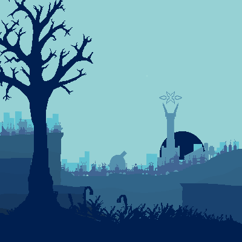

# ⚙️ Modpack Project — WIP

> A technical-narrative Minecraft modpack focused on infrastructure, symbolic progression, and high-tier automation.
---

  

## 📦 Overview

This modpack blends complex technical mods with a layered narrative progression. The player is gradually introduced to mechanical, magical, and computational systems through a series of curated quests and custom recipes, forming a coherent journey of industrial mastery.

Mods like **Create**, **Immersive Engineering**, **Thermal Expansion**, **Mekanism**, **Ender IO**, and **Applied Energistics 2** are deeply intertwined — each forming a "chapter" of progression and unlocking layers of interaction and discovery. Narrative elements are woven in through an enigmatic book that guides (and sometimes mocks) the player.

Custom mechanics include:

- ⚙️ New alloys and crafting components created through complex multi-step processes
- 🧱 Custom items and resources exclusive to this pack
- 🔁 Reworked progression trees and inter-mod dependency chains
- 📘 Story-driven quests with layered humor, sarcasm, and technical explanations

---

## 🎨 Assets and Visuals

- All **custom sprites** (items, fluids, and animated icons) were designed in-house using pixel art software and are original creations.
- Some **chapter banners and stylized titles** were generated with the help of AI tools to visualize concepts. These are placeholders intended to be **replaced by commissioned artwork** before the final release.
- A full breakdown of asset origins, licenses, and visual derivations is available in [`changed_material.md`](./changed_material.md), located in the root of the project.

---

## 📍 Status

- 🧪 **Currently in development**  
- 📜 All scripts handled via **KubeJS**
- 🎯 Focused on expert gameplay with immersive progression
- 🧵 Versioned and maintained via Git for backup and development tracking

---

## 📝 License

All original code and assets (excluding third-party mod content) are released under a permissive license for educational or private use. Please credit the author if reused.

---

## 💬 Notes

This is a labor of love and complexity. The pack is **not intended for casual players**, but for those who enjoy systems thinking, layered mechanics, and poetic chaos hidden beneath gears and circuits.

