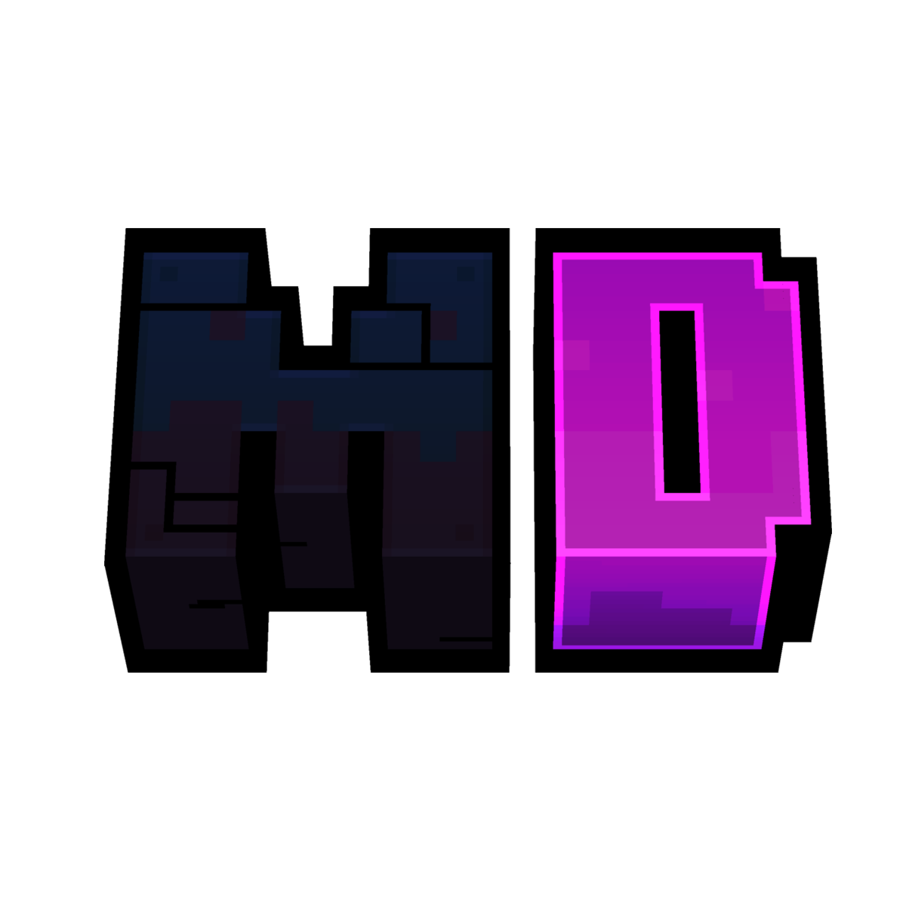
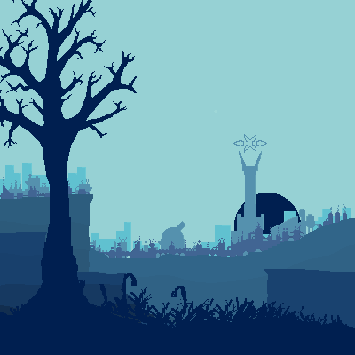

  

# Mechanized Depths

A Minecraft expert modpack about building infrastructure, connecting systems, and uncovering a story along the way.

**Minecraft 1.20.1 · Forge 47.4.0 · In development / playtest**

## About the pack

Create, Immersive Engineering, Thermal, Mekanism, Ender IO, and Applied Energistics 2 share a progression built around custom recipes and quests. Materials, machines, and production chains connect across mods, with an occasionally sarcastic guidebook to keep you company.

- Build production lines for custom alloys, components, and research.
- Work through technical and magical systems with recipes designed around their interactions.
- Discover custom machines, materials, and tool integrations as the chapters unfold.

  

## Before you play

**8 of the 21 planned main chapters are implemented. Even those eight are still unfinished.** Recipes, balance, quests, and progression are being tested and may change between builds.

If you want the complete intended experience, I recommend waiting for the official public release. Playing now will reveal parts of the pack while they are still taking shape.

If you enjoy testing, sharing ideas, or helping with code, artwork, writing, or other parts of development, this is a great time to join in. This is a labor of love, and every bit of feedback helps.

## Install the playtest

1. Install [Prism Launcher](https://prismlauncher.org/download/).
2. Download the [preconfigured Mechanized Depths profile](https://lucasmilanezs.github.io/MechanizedDepths/profiles/MechanizedDepths-Prism-v1.zip). In Prism, choose **Add Instance → Import from ZIP**.
3. Launch the instance and complete any manual downloads requested by the installer. Use the exact filenames and folders it shows.

The profile checks for updates before each launch and installs the latest playtest build through packwiz. After the initial setup, updates are automatic unless a new or updated file requires another manual download. The profile is configured to use up to **8 GB of RAM**.

The [playtest page](https://lucasmilanezs.github.io/MechanizedDepths/) lists named versions, installation instructions, and the files that currently require manual downloads. This repository contains the pack source; use the profile to install a playable instance. The public CurseForge release is coming soon.

Prefer another launcher? The page also offers a [CurseForge manifest ZIP](https://lucasmilanezs.github.io/MechanizedDepths/#curseforge), supported by CurseForge App, Prism Launcher, ATLauncher, GDLauncher, and other launchers that import this format. This option requires manual updates: download each new build and import it into a fresh instance. Back up your saves before transferring them and check the release notes for world compatibility.

## Feedback and contributions

Join [Discord](https://discord.gg/9zPQQ9Ezse) to discuss the pack or propose a contribution. Follow [Zambim on Reddit](https://www.reddit.com/user/Zambim_/) for development posts.

Use the [feedback form](https://docs.google.com/forms/d/e/1FAIpQLSf3ZI-cHsOjvl32u-UORdn5E-i22LccyxYvIlVMSvNv5okiNQ/viewform?usp=sharing) for impressions about pacing, grind, clarity, and progression. Report bugs through [GitHub Issues](https://github.com/lucasmilanezs/MechanizedDepths/issues), with your pack version, steps to reproduce, and relevant logs or screenshots.

## Artwork and credits

The pack includes original pixel art and adapted third-party assets. Every AI-generated artistic asset in a playable build is a temporary concept mock or placeholder. None is intended as permanent artwork; these assets will be replaced with artwork created by artists as development progresses.

See [Asset origins and modifications](changed_material.md) for credits, licenses, and the current attribution record. Original project code and artwork are covered by the [MIT license](LICENSE); third-party content retains its own terms.
